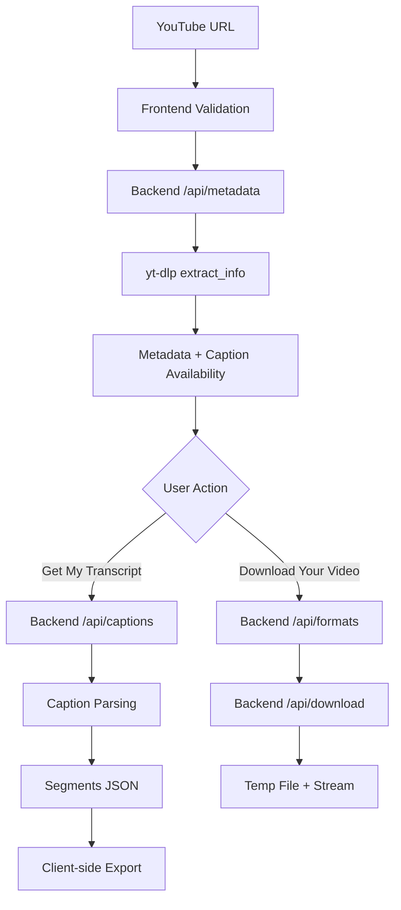

# Architecture

**Purpose:** Explain how VoxText AI is structured and how data flows between components.
**Audience:** Developers and maintainers working on system design, deployment, and scaling.
**Last Updated:** February 11, 2026
**Version:** v0.1

## Table of Contents
- Overview
- High-Level Architecture
- Core Components
- External Dependencies
- Request Lifecycle
- Data Flow Diagram
- Deployment Modes
- Scaling Notes
- Rate Limiting and Caching
- Logging and Monitoring
- Tech Decisions and Rationale
- Related Documents

## Overview
VoxText AI is a two-tier application: a React frontend for user interaction and a Flask backend that uses `yt-dlp` to extract metadata, captions, and downloadable media from YouTube. Transcript exports are generated in the browser to avoid server-side storage.

## High-Level Architecture
```mermaid
flowchart LR
  User -->|Paste URL| Frontend
  Frontend -->|GET /api/metadata| Backend
  Frontend -->|GET /api/captions| Backend
  Frontend -->|GET /api/formats| Backend
  Frontend -->|GET /api/download| Backend
  Backend -->|yt-dlp extract_info| YouTube
  Backend -->|Caption fetch (json3/vtt)| YouTube
  Backend -->|Media download| YouTube
  Frontend -->|Client-side export| BrowserDownload
  Frontend -.->|Optional: YouTube Data API, oEmbed, Piped| ExternalMetadata
```

## Core Components
### Frontend (React + Vite)
- Validates YouTube URLs with a regex.
- Orchestrates user flows (`Get My Transcript`, `Download Your Video`).
- Renders metadata, preview, progress bars, and download buttons.
- Generates `DOCX`, `TXT`, and `SRT` on the client.

### Backend (Flask)
- `GET /api/metadata`: uses `yt-dlp` to extract video metadata and detect language.
- `GET /api/captions`: fetches caption tracks and parses segments.
- `GET /api/formats`: selects available qualities and estimates sizes.
- `GET /api/download`: downloads media and streams it back to the client.
- In-memory cache for metadata with 5-minute TTL.
- Shared cookie jar for consistent YouTube access across requests.

### Worker/Background Processing
- No dedicated worker service. Download and caption extraction happen inline in the request.
- A background thread is used only for delayed temp-file cleanup.

## External Dependencies
- YouTube (source of metadata, captions, and media).
- `yt-dlp` (Python package for extraction and downloads).
- `ffmpeg` (required for MP3 extraction and MP4 merging).
- Optional frontend fallbacks: YouTube Data API, oEmbed endpoints, Piped API, and CORS proxies.

## Request Lifecycle
1. User enters a URL and clicks `Read my URL`.
2. Frontend calls `/api/metadata` to retrieve title, duration, and caption info.
3. User selects `Get My Transcript`, then the frontend calls `/api/captions` and exports `DOCX`, `TXT`, or `SRT` locally.
4. User selects `Download Your Video`, then the frontend calls `/api/formats` and `/api/download` to stream the file.

## Data Flow Diagram


## Deployment Modes
### Local
- Backend: `python server.py` on `127.0.0.1:5000`.
- Frontend: `npm run dev` on Vite default port.

### Cloud (VPS/Render)
- Backend requires Python, `yt-dlp`, and `ffmpeg`.
- Frontend can be deployed as static assets (e.g., Vercel, Cloudflare Pages) but must point to the backend URL.

## Scaling Notes
- The first bottlenecks are `yt-dlp` calls and large media downloads.
- In-memory cache reduces repeated metadata extraction but does not scale across instances.
- Heavy downloads can saturate CPU, network, and disk I/O.

## Rate Limiting and Caching
- Current caching: in-memory metadata cache with 5-minute TTL.
- No explicit rate limiting is implemented. A future enhancement can add per-IP limits or a queue.

## Logging and Monitoring
- Frontend uses console logs for development visibility.
- Backend returns explicit error messages but lacks structured logs.
- Recommended: add request IDs, structured logging, and basic metrics (success rate, 429 rate, average duration).

## Tech Decisions and Rationale
- `yt-dlp` provides robust metadata and caption extraction without proprietary APIs.
- Client-side transcript export avoids storing user data on the server.
- Simple Flask API keeps deployment lightweight and easy to self-host.

## Related Documents
- [README](README.md)
- [API](API.md)
- [User Flow](User-flow.md)
- [Language Detect Flow](Language_Detect_Flow.md)
