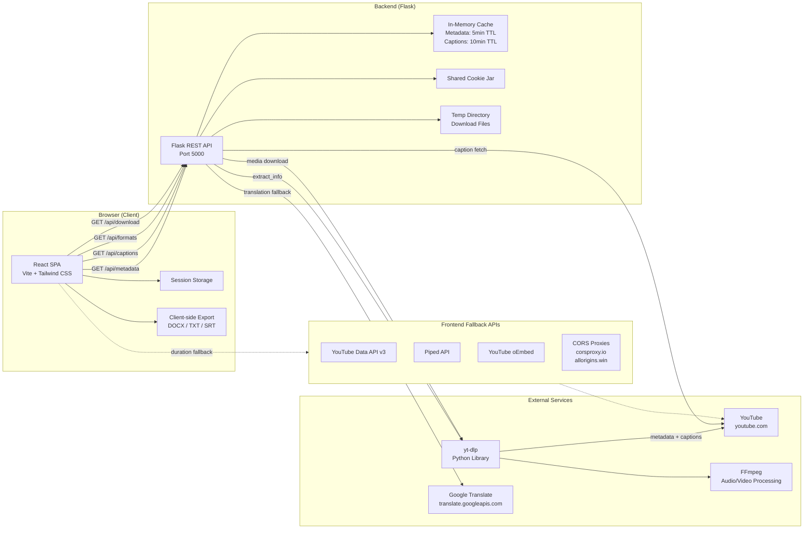
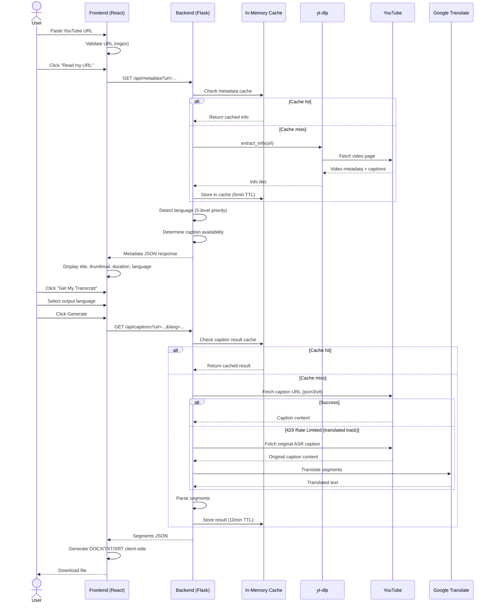
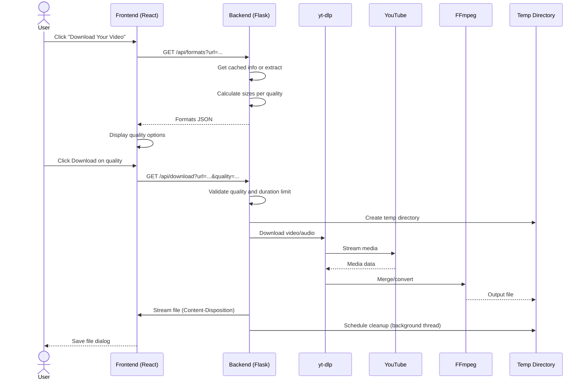
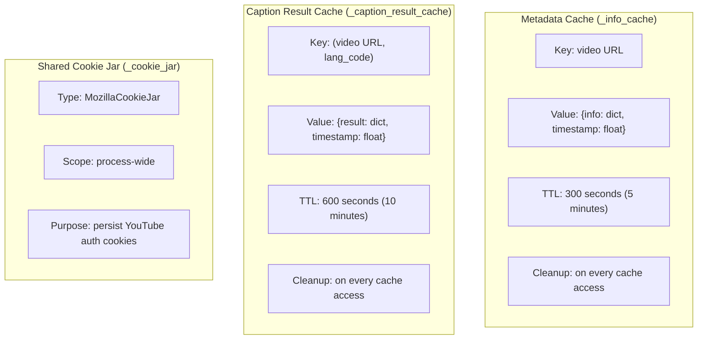
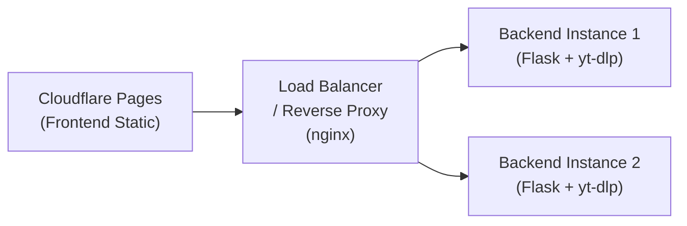

# Architecture

**VoxText AI — System Architecture Documentation**

> **Purpose:** Explain how VoxText AI is structured, how data flows between components, and the rationale behind technical decisions.
> **Audience:** Developers, maintainers, and DevOps engineers working on system design, deployment, and scaling.
> **Last Updated:** 2026-02-12
> **Version:** 0.1.0

---

## Table of Contents

- [Overview](#overview)
- [High-Level Architecture Diagram](#high-level-architecture-diagram)
- [Core Components](#core-components)
- [External Dependencies](#external-dependencies)
- [Request Lifecycle](#request-lifecycle)
- [Data Flow Diagram](#data-flow-diagram)
- [Caching Architecture](#caching-architecture)
- [Deployment Modes](#deployment-modes)
- [Scaling Notes](#scaling-notes)
- [Rate Limiting and Caching Strategy](#rate-limiting-and-caching-strategy)
- [Logging and Monitoring](#logging-and-monitoring)
- [Tech Decisions and Rationale](#tech-decisions-and-rationale)
- [Related Documents](#related-documents)

---

## Overview

VoxText AI is a two-tier application: a React single-page application (SPA) for user interaction and a Flask REST API backend that uses `yt-dlp` to extract metadata, captions, and downloadable media from YouTube. Transcript exports (DOCX, TXT, SRT) are generated client-side in the browser, eliminating server-side file storage for transcripts. Video and audio downloads are streamed through the backend and cleaned up immediately after delivery.

---

## High-Level Architecture Diagram



---

## Core Components

### Frontend (React + Vite + TypeScript)

| Aspect | Detail |
|---|---|
| **Framework** | React 18.3.1 with TypeScript |
| **Bundler** | Vite 6.3.5 with `@vitejs/plugin-react` |
| **Styling** | Tailwind CSS 4.1.12 with custom theme (glassmorphism, neon green accents) |
| **UI Components** | Radix UI primitives, Lucide React icons, Motion animations |
| **Architecture** | Single `App.tsx` component with all state and logic |
| **State Management** | React `useState` + `useRef` hooks; no external state library |
| **Persistence** | `sessionStorage` for state persistence across page refreshes |
| **URL Validation** | Client-side regex: `/^(https?:\/\/)?(www\.)?(youtube\.com\/watch\?v=\|youtube\.com\/shorts\/\|youtu\.be\/)[a-zA-Z0-9_-]{11}([?&].*)?$/` |
| **Export** | Client-side generation of DOCX (HTML table), TXT (plain text), SRT (timed subtitles) |
| **Fallback Chain** | 7+ methods for metadata: yt-dlp backend, YouTube Data API, Piped API, oEmbed (direct + proxied), HTML scraping, noembed.com |

### Backend (Flask + Python)

| Aspect | Detail |
|---|---|
| **Framework** | Flask 3.1+ with `flask-cors` 6.0+ |
| **Python Version** | 3.11 (Docker) / 3.9+ (local) |
| **API Pattern** | RESTful GET endpoints returning JSON |
| **YouTube Interaction** | `yt-dlp` library for all extraction and downloads |
| **Caching** | Two in-memory dictionaries with TTL-based cleanup |
| **Cookie Management** | Shared `MozillaCookieJar` across all `yt-dlp` sessions |
| **File Management** | `tempfile.mkdtemp()` for downloads; background thread cleanup |
| **Translation** | Google Translate free API (`translate.googleapis.com`) as fallback for rate-limited translated captions |
| **Language Detection** | 5-priority chain: title patterns, script detection, tags, YouTube metadata, ASR language |

**Backend Endpoints:**

| Endpoint | Purpose |
|---|---|
| `GET /api/metadata` | Extract video metadata, language, and caption availability |
| `GET /api/captions` | Fetch and parse caption segments with language resolution |
| `GET /api/formats` | Report available download qualities with size estimates |
| `GET /api/download` | Download and stream video/audio file |

### Worker / Background Processing

- **No dedicated worker service.** All processing (metadata extraction, caption fetching, video downloading) happens inline within the HTTP request lifecycle.
- **Background threads** are used solely for delayed temp-file cleanup (5-10 second delay after response delivery).
- **No job queue** (Redis, Celery, etc.) in the current architecture.

---

## External Dependencies

| Dependency | Type | Purpose | Failure Impact |
|---|---|---|---|
| **YouTube** | External service | Source of all metadata, captions, and media | Complete feature failure |
| **yt-dlp** | Python package | Extraction and download engine | Backend cannot function |
| **FFmpeg** | System binary | Audio extraction (MP3) and video merging (MP4) | Audio downloads and some video downloads fail |
| **Google Translate** | External API (free) | Translation fallback for rate-limited captions | Translated captions may fail; original language still works |
| **YouTube Data API** | External API (optional) | More reliable duration fetching | Fallback to other duration methods |
| **Piped API** | External API (optional) | CORS-friendly duration and metadata | Fallback to HTML scraping |
| **CORS Proxies** | External services | Frontend metadata fallbacks | Fallback to direct oEmbed |

---

## Request Lifecycle

### Transcript Flow



### Download Flow



---

## Caching Architecture



| Cache | Key | TTL | Purpose |
|---|---|---|---|
| `_info_cache` | Video URL | 5 minutes | Avoid duplicate `yt-dlp` `extract_info` calls |
| `_caption_result_cache` | (Video URL, Language) | 10 minutes | Avoid repeated caption fetch + parse |
| `_cookie_jar` | N/A (shared) | Process lifetime | Persist YouTube cookies to reduce 429s |

---

## Deployment Modes

### Local Development

```
Frontend (Vite dev server)     Backend (Flask dev server)
http://localhost:5173    --->  http://127.0.0.1:5000
```

- Frontend: `npm run dev` with hot module replacement
- Backend: `python server.py` with Flask debug mode
- No Docker required; direct pip install for backend dependencies

### Docker (Backend Only)

```dockerfile
FROM python:3.11-slim
RUN apt-get update && apt-get install -y ffmpeg curl
COPY requirements.txt .
RUN pip install --no-cache-dir -r requirements.txt
COPY server.py .
EXPOSE 5000
CMD ["python", "server.py"]
```

- Backend runs in Docker container with FFmpeg pre-installed
- Frontend can be built separately and served as static files

### Cloud Deployment

| Component | Platform | Notes |
|---|---|---|
| **Frontend** | Cloudflare Pages | Build with `npm run build`, deploy `dist/` folder. Update backend URL in source. |
| **Backend** | Render / VPS | Python 3.11 + FFmpeg + yt-dlp. Ensure adequate RAM for downloads. |
| **Backend** | Hostinger / Ubuntu VPS | Install Python, FFmpeg, yt-dlp. Run behind nginx reverse proxy. |

### Production Architecture (Recommended)



---

## Scaling Notes

### What Breaks First

1. **yt-dlp CPU usage** — Each `extract_info` call and download consumes CPU. Concurrent requests multiply this.
2. **Network I/O** — Large video downloads saturate bandwidth, especially at higher qualities.
3. **Disk I/O** — Temp file writes for downloads can bottleneck on slow disks.
4. **Memory** — In-memory caches grow with unique video URLs. Each `yt-dlp` info dict can be several KB.
5. **YouTube rate limits** — High request volume triggers 429 responses.

### How to Scale

| Bottleneck | Solution |
|---|---|
| CPU (yt-dlp) | Add more backend instances behind a load balancer |
| Network (downloads) | Use CDN or direct YouTube links where possible |
| Memory (cache) | Switch to Redis or Memcached for shared cache |
| Disk (temp files) | Use RAM disk (`tmpfs`) for faster temp I/O |
| Rate limits | Implement request queuing and per-IP throttling |
| Concurrent downloads | Add a job queue (Redis + RQ or Celery) for download tasks |

---

## Rate Limiting and Caching Strategy

### Current Implementation

- **No explicit rate limiting** on the API server.
- **Metadata cache** (5-minute TTL) reduces duplicate `yt-dlp` calls for the same video.
- **Caption result cache** (10-minute TTL) prevents re-fetching captions for the same video and language.
- **Shared cookie jar** maintains YouTube session cookies to reduce authentication-related 429s.

### Recommended Future Enhancements

- **Per-IP rate limiting** using Flask middleware or nginx `limit_req`
- **Request queuing** for downloads using Redis + RQ
- **Distributed cache** using Redis for multi-instance deployments
- **Exponential backoff** for YouTube 429 responses
- **Circuit breaker** pattern for external API calls

---

## Logging and Monitoring

### Current State

| Layer | Logging Method | Detail |
|---|---|---|
| Frontend | `console.log` | Emoji-prefixed messages for each metadata fetch method |
| Backend | `print()` | Translation failures and debug info |

### Recommended Improvements

- **Structured logging** (JSON format) with log levels (DEBUG, INFO, WARN, ERROR)
- **Request IDs** for tracing requests across frontend and backend
- **Metrics collection** (Prometheus or StatsD): request count, latency, error rate, cache hit ratio
- **Health endpoint** (`/healthz`) for liveness probes
- **Alerting** on elevated error rates or 429 response frequency

---

## Tech Decisions and Rationale

| Decision | Rationale |
|---|---|
| **yt-dlp over YouTube Data API** | yt-dlp provides metadata, captions, and downloads in one tool. No API key required for core functionality. More robust extraction than official API. |
| **Flask over FastAPI** | Simpler deployment and lower learning curve. Synchronous processing is sufficient for the current scale. |
| **Client-side transcript export** | Avoids server-side file storage for transcripts. Reduces server load and privacy concerns. |
| **In-memory cache over Redis** | Simplicity for single-instance deployment. No external dependency needed. Trade-off: no cache sharing across instances. |
| **Google Translate free API** | Fallback for YouTube's rate-limited translated caption tracks. No API key needed. Trade-off: may have its own rate limits. |
| **Tailwind CSS over component library** | Full design control with utility-first approach. Smaller bundle than full component libraries. |
| **Radix UI for primitives** | Accessible, unstyled component primitives. Compatible with Tailwind for custom styling. |
| **Single App.tsx** | Rapid prototyping. Trade-off: component extraction recommended for maintainability. |
| **Session storage over local storage** | State is session-scoped (not persistent across browser sessions). Appropriate for in-progress work. |
| **Shared cookie jar** | Reduces YouTube 429 rate limits by maintaining authentication cookies across requests. |

---

## Related Documents

- [README](README.md) — Project overview and navigation hub
- [API](API.md) — Full API specification
- [User Flow](User-flow.md) — Detailed user flow documentation
- [Language Detect Flow](Language_Detect_Flow.md) — Language detection algorithm
- [Setup Guide](Setup-Guide.md) — Installation and deployment guide
- [Security and Privacy](Security-Privacy.md) — Security practices and data handling
