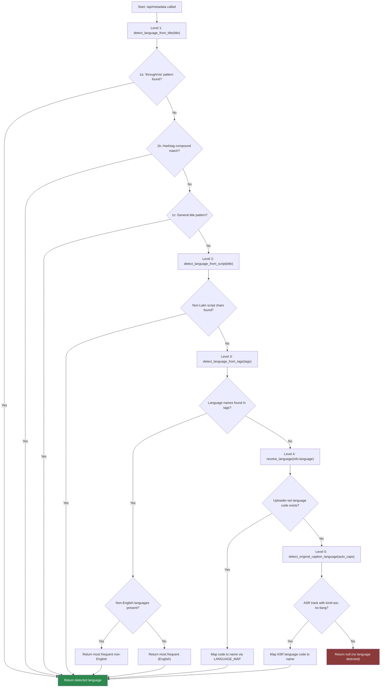

# Language Detection Flow

**Purpose:** Comprehensive reference for how VoxText AI detects the spoken language of a YouTube video and selects the appropriate caption track. Covers the full backend algorithm, frontend display logic, Unicode script detection, alias resolution, and edge cases.

**Audience:** Developers and contributors working on language handling, captions, or frontend UI behavior.

**Last Updated:** 2026-02-12

**Version:** 0.1.0

---

## Table of Contents

- [Definitions](#definitions)
- [Algorithm Overview](#algorithm-overview)
  - [Inputs and Outputs](#inputs-and-outputs)
  - [5-Level Priority Chain](#5-level-priority-chain)
  - [Level 1 -- Title Pattern Matching](#level-1----title-pattern-matching)
  - [Level 2 -- Unicode Script Detection](#level-2----unicode-script-detection)
  - [Level 3 -- Tag-Based Detection](#level-3----tag-based-detection)
  - [Level 4 -- YouTube Studio Language Field](#level-4----youtube-studio-language-field)
  - [Level 5 -- Auto-Caption ASR Language](#level-5----auto-caption-asr-language)
- [Unicode Script Ranges Table](#unicode-script-ranges-table)
- [Caption Language Selection Algorithm](#caption-language-selection-algorithm)
  - [Auto-Pick Logic](#auto-pick-logic)
  - [Language Resolution Chain](#language-resolution-chain)
  - [Language Alias Mapping](#language-alias-mapping)
  - [Translation Fallback](#translation-fallback)
- [LANGUAGE_MAP Reference](#language_map-reference)
- [LANGUAGE_NAMES Reverse Map](#language_names-reverse-map)
- [Frontend UI Behavior](#frontend-ui-behavior)
  - [Language Detected Display](#language-detected-display)
  - [Subtitles-Detected Dropdown](#subtitles-detected-dropdown)
  - [Update Timing](#update-timing)
  - [Unknown or Missing Language](#unknown-or-missing-language)
- [Priority Chain Diagram](#priority-chain-diagram)
- [Edge Cases](#edge-cases)
- [Example JSON Outputs](#example-json-outputs)
  - [Metadata Response](#metadata-response)
  - [Captions Response](#captions-response)
  - [Captions Response with Auto-Translation](#captions-response-with-auto-translation)
- [Related Documents](#related-documents)

---

## Definitions

| Term | Meaning |
|------|---------|
| **Language Detected** | The spoken/content language of the video, inferred by the backend's 5-level priority chain from `yt-dlp` metadata. Displayed in the UI header as `Language Detected: {language}`. |
| **Auto Detect** | The default output-language option in the transcript dropdown. When selected, the system uses the backend-picked caption track without any translation. Internally this maps to `selectedOutputLanguage === 'auto'`. |
| **Subtitles-Detected** | The caption track that will actually be used for transcript generation. Shown in the output-language dropdown as `Subtitles-Detected: {captionLanguage}`. This may differ from **Language Detected** when, for example, the video's spoken language is Tamil but only English auto-captions are available. |
| **Output Language** | The language the user explicitly selects from the dropdown. When different from Auto Detect, it requests a translated caption track from YouTube or triggers the Google Translate fallback. |

---

## Algorithm Overview

### Inputs and Outputs

**Inputs** (extracted via `yt-dlp` before any language detection):

| Field | Source | Example |
|-------|--------|---------|
| `title` | Video title string | `"Learn JavaScript through Tamil \| Full Course"` |
| `tags` | Video tags array | `["tamil", "javascript", "coding tutorial"]` |
| `language` | Uploader-set language in YouTube Studio | `"ta"` |
| `subtitles` | Manual subtitle tracks dict | `{"en": [...], "ta": [...]}` |
| `automatic_captions` | Auto-generated caption tracks dict | `{"ta": [{"url": "...", "ext": "json3"}]}` |

**Outputs** (returned by `/api/metadata`):

| Field | Type | Description |
|-------|------|-------------|
| `language` | `string \| null` | Detected spoken language (human-readable name) |
| `captionLanguage` | `string \| null` | Caption track name that will be used for transcripts |
| `captionLanguageCode` | `string \| null` | ISO code of the selected caption track |
| `hasCaptions` | `boolean` | Whether any captions exist at all |
| `availableCaptionLanguages` | `object` | Map of all available caption tracks with type |

### 5-Level Priority Chain

The backend evaluates each level in strict order. The **first non-null result wins** and no further levels are checked.

```
Level 1: detect_language_from_title(title)      -- Pattern matching in title text
Level 2: detect_language_from_script(title)      -- Unicode script range scanning
Level 3: detect_language_from_tags(tags)         -- Language mentions in video tags
Level 4: resolve_language(info["language"])       -- YouTube Studio uploader field
Level 5: detect_original_caption_language(auto)  -- ASR track language code
```

### Level 1 -- Title Pattern Matching

**Function:** `detect_language_from_title(title)`

This level has three internal sub-priorities, each evaluated in order:

**Sub-priority 1a: "through/via [language]" patterns**

Scans for phrases like `"through Tamil"`, `"thru Hindi"`, or `"via Spanish"` in the title. This captures the **medium of instruction** (the spoken language), not the subject being taught.

```
Regex: (?:through|thru|via)\s+{lang_name}(?:[\s\.\,\|\)\]!?]|$)
```

Example: `"Learn Japanese through Tamil"` returns `"Tamil"` (not Japanese).

Languages are matched longest-first to prevent partial matches (e.g., `"Portuguese (Brazil)"` before `"Portuguese"`).

**Sub-priority 1b: Hashtag parsing**

Extracts hashtags from the title and scans for compound patterns like `#englishthroughtamil` or `#learnviahindi`.

```
Regex within hashtag: (?:through|thru|via){lang_name}$
```

Example: `"CSS Tutorial #englishthroughtamil"` returns `"Tamil"`.

**Sub-priority 1c: General language mention patterns**

Matches language names appearing in common title delimiters:

- Pipe-separated: `| Tamil |` or `| Tamil`
- Parenthesized: `(Tamil)`
- Dash-separated: `- Tamil`
- Preceded by "in": `in Tamil`
- Comma-separated or at string boundaries

```
Regex: (?:^|[\|\(\[\-\x{2013}\x{2014},\s]){lang_name}(?:[\|\)\]\-\x{2013}\x{2014},\s]|$)
```

Example: `"Funny Cat Videos | Tamil | 2024"` returns `"Tamil"`.

### Level 2 -- Unicode Script Detection

**Function:** `detect_language_from_script(title)`

When the title contains non-Latin characters, this function iterates through the `SCRIPT_LANGUAGE_MAP` and checks each character's Unicode code point against known script ranges. The **first matching script wins**.

Example: A title like `"JavaScript Tutorial" ` contains Tamil characters (U+0B80-U+0BFF), so this returns `"Tamil"`.

See the [Unicode Script Ranges Table](#unicode-script-ranges-table) below for all 22 supported scripts.

### Level 3 -- Tag-Based Detection

**Function:** `detect_language_from_tags(tags)`

Counts how many tags mention each known language name and returns the **most frequently mentioned** language. English is excluded from the result if any non-English language was found, because many non-English creators include generic English tags.

```python
# Simplified logic:
non_english = {k: v for k, v in lang_counts.items() if k != "English"}
if non_english:
    return max(non_english, key=non_english.get)
return max(lang_counts, key=lang_counts.get)
```

Example: Tags `["tamil comedy", "tamil youtube", "funny video", "english"]` returns `"Tamil"` (count 2 vs English count 1, and English is excluded when non-English exists).

### Level 4 -- YouTube Studio Language Field

**Function:** `resolve_language(info.get("language"))`

Maps the uploader-set language code from YouTube Studio to a human-readable name using `LANGUAGE_MAP`. Falls back to the base language if the full code is not found.

```python
normalized = code.lower().strip()
return LANGUAGE_MAP.get(normalized) or LANGUAGE_MAP.get(normalized.split("-")[0])
```

Example: `"pt-br"` resolves to `"Portuguese (Brazil)"`. If the code were `"pt-XX"`, it would fall back to `"Portuguese"`.

### Level 5 -- Auto-Caption ASR Language

**Function:** `detect_original_caption_language(auto_caps)`

Finds the original ASR (Automatic Speech Recognition) track in `automatic_captions`. The original track is identified by having `kind=asr` in its URL and **not** having a `tlang` parameter (which indicates a translated track).

```python
for lang_code, tracks in auto_caps.items():
    for track in tracks[:1]:
        url = track.get("url", "")
        if "kind=asr" in url and "tlang" not in url:
            return resolve_language(lang_code)
```

Example: If `automatic_captions` contains `{"ta": [{"url": "...&kind=asr..."}]}`, this returns `"Tamil"`.

---

## Unicode Script Ranges Table

All 22 scripts recognized by `SCRIPT_LANGUAGE_MAP`:

| Language | Script Name | Unicode Start | Unicode End | Hex Range |
|----------|------------|---------------|-------------|-----------|
| Tamil | Tamil | U+0B80 | U+0BFF | `0x0B80` - `0x0BFF` |
| Hindi | Devanagari | U+0900 | U+097F | `0x0900` - `0x097F` |
| Bengali | Bengali | U+0980 | U+09FF | `0x0980` - `0x09FF` |
| Telugu | Telugu | U+0C00 | U+0C7F | `0x0C00` - `0x0C7F` |
| Kannada | Kannada | U+0C80 | U+0CFF | `0x0C80` - `0x0CFF` |
| Malayalam | Malayalam | U+0D00 | U+0D7F | `0x0D00` - `0x0D7F` |
| Sinhala | Sinhala | U+0D80 | U+0DFF | `0x0D80` - `0x0DFF` |
| Gujarati | Gujarati | U+0A80 | U+0AFF | `0x0A80` - `0x0AFF` |
| Punjabi | Gurmukhi | U+0A00 | U+0A7F | `0x0A00` - `0x0A7F` |
| Thai | Thai | U+0E00 | U+0E7F | `0x0E00` - `0x0E7F` |
| Lao | Lao | U+0E80 | U+0EFF | `0x0E80` - `0x0EFF` |
| Arabic | Arabic | U+0600 | U+06FF | `0x0600` - `0x06FF` |
| Hebrew | Hebrew | U+0590 | U+05FF | `0x0590` - `0x05FF` |
| Greek | Greek | U+0370 | U+03FF | `0x0370` - `0x03FF` |
| Russian | Cyrillic | U+0400 | U+04FF | `0x0400` - `0x04FF` |
| Georgian | Georgian | U+10A0 | U+10FF | `0x10A0` - `0x10FF` |
| Amharic | Ethiopic | U+1200 | U+137F | `0x1200` - `0x137F` |
| Burmese | Myanmar | U+1000 | U+109F | `0x1000` - `0x109F` |
| Khmer | Khmer | U+1780 | U+17FF | `0x1780` - `0x17FF` |
| Korean | Hangul | U+AC00 | U+D7AF | `0xAC00` - `0xD7AF` |
| Japanese | Hiragana | U+3040 | U+309F | `0x3040` - `0x309F` |
| Chinese | CJK Unified Ideographs | U+4E00 | U+9FFF | `0x4E00` - `0x9FFF` |

**Notes on shared scripts:**
- **Devanagari** (Hindi range) is also used by Marathi and Nepali. The system returns `"Hindi"` for any Devanagari text.
- **Arabic** script range also covers Urdu and Persian. The system returns `"Arabic"` for any Arabic-script text.
- **Cyrillic** (Russian range) also covers Serbian, Ukrainian, and Bulgarian. The system returns `"Russian"`.
- **CJK Unified Ideographs** (Chinese range) overlaps with Japanese kanji. If the title contains only kanji and no hiragana, it will be detected as `"Chinese"`.

---

## Caption Language Selection Algorithm

Caption language selection is **separate** from the "Language Detected" algorithm above. It determines which caption track will actually be fetched and returned when the user requests a transcript.

### Auto-Pick Logic

When no `lang` query parameter is provided to `/api/captions`, the backend auto-picks:

```
1. First manual subtitle track (excluding "live_chat")
2. Original ASR auto-caption (kind=asr, no tlang in URL)
3. First auto-caption track (any)
```

The same logic is mirrored in `/api/metadata` to pre-populate `captionLanguage` and `captionLanguageCode`.

### Language Resolution Chain

When a `lang` parameter is provided, the backend resolves it through three steps:

```
Step 1: Case-insensitive exact match
        "Ta" -> matches "ta" in manual_subs or auto_caps

Step 2: Alias mapping (LANG_ALIASES)
        "zh" -> "zh-Hans" -> look up "zh-Hans" in tracks

Step 3: Base-language fallback
        "en-US" -> split on "-" -> "en" -> match any "en-*" track
```

Each step checks manual subtitles first, then auto-captions.

### Language Alias Mapping

| Input Code | Maps To | Reason |
|-----------|---------|--------|
| `zh` | `zh-Hans` | YouTube uses `zh-Hans` for Simplified Chinese |
| `zh-tw` | `zh-Hant` | YouTube uses `zh-Hant` for Traditional Chinese |
| `zh-cn` | `zh-Hans` | Alternative code for Simplified Chinese |
| `pt-br` | `pt` | YouTube stores Brazilian Portuguese under `pt` |

These aliases are defined in `LANG_ALIASES` within the `/api/captions` handler.

### Translation Fallback

When YouTube returns HTTP 429 for translated caption URLs (those containing `tlang=`), the backend falls back to:

1. Fetch the **original ASR caption track** (no `tlang` in URL, which YouTube serves without rate limiting).
2. Parse the original captions into timed segments.
3. Translate each segment in batches via the **Google Translate free API** (`translate.googleapis.com`).
4. Return the translated segments with `"type": "auto-translated"`.

Batching respects a `MAX_ENCODED_LEN = 5000` byte limit for URL-encoded query strings to stay within Google Translate's URL length limits. Non-Latin characters expand 3-9x when URL-encoded, so the system measures actual encoded byte length, not character count.

If Google Translate fails for a batch, the original (untranslated) text is preserved for those segments.

---

## LANGUAGE_MAP Reference

Representative excerpt of the 70+ language code to name mappings in `LANGUAGE_MAP`:

| Code | Name | Code | Name |
|------|------|------|------|
| `en` | English | `en-gb` | English (UK) |
| `es` | Spanish | `fr` | French |
| `de` | German | `it` | Italian |
| `pt` | Portuguese | `pt-br` | Portuguese (Brazil) |
| `ru` | Russian | `ja` | Japanese |
| `ko` | Korean | `zh` | Chinese |
| `zh-cn` | Chinese (Simplified) | `zh-tw` | Chinese (Traditional) |
| `zh-hans` | Chinese (Simplified) | `zh-hant` | Chinese (Traditional) |
| `ar` | Arabic | `hi` | Hindi |
| `tr` | Turkish | `nl` | Dutch |
| `pl` | Polish | `sv` | Swedish |
| `da` | Danish | `fi` | Finnish |
| `no` | Norwegian | `th` | Thai |
| `vi` | Vietnamese | `id` | Indonesian |
| `ms` | Malay | `tl` | Filipino |
| `fil` | Filipino | `uk` | Ukrainian |
| `cs` | Czech | `el` | Greek |
| `he` | Hebrew | `hu` | Hungarian |
| `ro` | Romanian | `bg` | Bulgarian |
| `hr` | Croatian | `sk` | Slovak |
| `sl` | Slovenian | `sr` | Serbian |
| `lt` | Lithuanian | `lv` | Latvian |
| `et` | Estonian | `bn` | Bengali |
| `ta` | Tamil | `te` | Telugu |
| `ml` | Malayalam | `kn` | Kannada |
| `mr` | Marathi | `gu` | Gujarati |
| `pa` | Punjabi | `ur` | Urdu |
| `fa` | Persian | `sw` | Swahili |
| `af` | Afrikaans | `ca` | Catalan |
| `eu` | Basque | `gl` | Galician |
| `is` | Icelandic | `am` | Amharic |
| `az` | Azerbaijani | `my` | Burmese |
| `ka` | Georgian | `ha` | Hausa |
| `ig` | Igbo | `kk` | Kazakh |
| `km` | Khmer | `lo` | Lao |
| `mn` | Mongolian | `ne` | Nepali |
| `si` | Sinhala | `uz` | Uzbek |
| `yo` | Yoruba | `zu` | Zulu |

---

## LANGUAGE_NAMES Reverse Map

`LANGUAGE_NAMES` is built from `LANGUAGE_MAP` values (lowercased) plus common variant names used in video titles. This allows title scanning to recognize informal or alternate language names.

| Variant Name | Maps To |
|-------------|---------|
| `mandarin` | Chinese |
| `cantonese` | Chinese |
| `brazilian portuguese` | Portuguese (Brazil) |
| `brazilian` | Portuguese (Brazil) |
| `tagalog` | Filipino |
| `farsi` | Persian |
| `bangla` | Bengali |
| `odia` / `oriya` | Odia |
| `assamese` | Assamese |
| `burmese` | Burmese |
| `khmer` | Khmer |
| `lao` | Lao |
| `mongolian` | Mongolian |
| `tibetan` | Tibetan |
| `uzbek` | Uzbek |
| `kazakh` | Kazakh |
| `azerbaijani` | Azerbaijani |
| `georgian` | Georgian |
| `armenian` | Armenian |
| `amharic` | Amharic |
| `yoruba` | Yoruba |
| `igbo` | Igbo |
| `hausa` | Hausa |
| `zulu` | Zulu |
| `xhosa` | Xhosa |
| `icelandic` | Icelandic |

---

## Frontend UI Behavior

### Language Detected Display

The header bar within the URL input container always shows:

```
Language Detected: {detectedLanguage}
```

- **Initial state:** displays `Language Detected: --` (em dash character).
- **During processing:** displays `Language Detected: Detecting...`.
- **After completion:** displays the language name returned by the backend (e.g., `Language Detected: Tamil`).
- **Fallback:** if the backend returns no language, the frontend tries lightweight heuristics (URL `hl` parameter, HTML `lang` attribute, `inLanguage` meta tag) and ultimately defaults to `"English"`.

### Subtitles-Detected Dropdown

The output-language dropdown in the transcript panel displays:

| Condition | Dropdown Shows |
|-----------|---------------|
| Captions exist and `captionLanguage` is known | `Subtitles-Detected: {captionLanguage}` (e.g., `Subtitles-Detected: Tamil`) |
| Captions exist but `captionLanguage` is unknown | `Subtitles-Detected: {detectedLanguage}` (falls back to the header language) |
| No captions available (`hasCaptions === false`) | `Subtitles-Detected: Captions not available` |
| Language is still detecting or unknown | `Subtitles-Detected` (no language suffix) |

When the user selects a specific language from the dropdown (e.g., `"Spanish"`), the dropdown shows that language name directly (not prefixed with `Subtitles-Detected`).

### Update Timing

1. User clicks **"Read my URL"**.
2. Frontend fires three parallel requests: `fetchVideoTitle`, `detectLanguage`, `fetchVideoMetadata`.
3. `fetchVideoMetadata` calls `/api/metadata` and returns `language`, `captionLanguage`, `captionLanguageCode`, `hasCaptions`, and `availableCaptionLanguages`.
4. On completion, `detectedLanguage` is set from `metadata.language` (preferred) or standalone detection fallback.
5. `captionLanguage` and `captionLanguageCode` are set from the metadata response.
6. All values are persisted to `sessionStorage` so they survive page refreshes.

### Unknown or Missing Language

- If the backend returns `language: null` and all frontend heuristics fail, the display defaults to `"English"`.
- If the backend returns `captionLanguage: null` but `hasCaptions: true`, the dropdown shows `Subtitles-Detected: {detectedLanguage}` as a best-effort fallback.
- The frontend never shows `null` or `undefined` to the user.

---

## Priority Chain Diagram



---

## Edge Cases

### Captions Disabled

When a video has no manual subtitles and no auto-captions:
- `hasCaptions` is `false`.
- `captionLanguage` and `captionLanguageCode` are `null`.
- The transcript panel dropdown shows `Subtitles-Detected: Captions not available`.
- The "Get Transcript" button is disabled and reads `"Captions Not Available"`.
- Attempting to call `/api/captions` returns `404` with `"No captions available for this video"`.

### Multiple Languages in Captions

When both manual subtitles and auto-captions exist in multiple languages:
- The auto-pick logic selects the **first manual subtitle** (excluding `live_chat`).
- `availableCaptionLanguages` lists all tracks, each tagged as `"manual"` or `"auto"`.
- The user can override by selecting a specific language from the dropdown, which passes `lang=` to `/api/captions`.

### Auto Captions Missing

When manual subtitles exist but no auto-captions:
- Language detection Level 5 is skipped (returns `null`).
- Caption selection still works via manual subtitles.

When no manual subtitles exist and auto-captions are present:
- The original ASR track is selected for caption language.

### Non-Latin Titles

A title written in a non-Latin script (e.g., Devanagari, Tamil, Arabic) will be caught by Level 2 (script detection) even if Level 1 (title patterns) found nothing. This is important because pattern matching operates on lowercased text and may not match non-Latin language names.

Note: If a title mixes Latin and non-Latin scripts (e.g., `"JavaScript Tutorial "`), Level 2 scans character-by-character and the **first matching script** determines the language.

### Ambiguous Titles

- A title like `"English through Tamil"` triggers Level 1a and returns `"Tamil"` (the medium, not the subject).
- A title like `"Language Tutorial"` with no specific language name falls through to Level 2, then Level 3, and so on.
- A title like `"Tamil vs Hindi"` may match `"Tamil"` first since `LANGUAGE_NAMES` is iterated in longest-name-first order. If both are the same length, iteration order depends on the dictionary.

### Live Streams

- `isLive` is returned as `true` in metadata.
- The frontend disables both "Get My Transcript" and "Download Your Video" buttons.
- The video duration display is replaced with a red pulsing `"LIVE"` indicator.
- Language detection still runs normally on the title and tags.

### YouTube HTTP 429 Rate Limiting

- When YouTube rate-limits translated caption requests (URLs containing `tlang=`), the backend falls back to fetching the original ASR track and translating via Google Translate.
- The result type changes from `"auto"` to `"auto-translated"`.
- If Google Translate also fails, the error `"Failed to fetch captions. Please try again."` is returned with HTTP 500.

---

## Example JSON Outputs

### Metadata Response

A Tamil video with manual subtitles and auto-captions:

```json
{
  "duration": 612,
  "channelName": "Tamil Tech Tutorials",
  "title": "Learn JavaScript | Tamil | Full Course 2026",
  "thumbnail": "https://i.ytimg.com/vi/abc123xyz/maxresdefault.jpg",
  "videoId": "abc123xyz",
  "language": "Tamil",
  "playableInEmbed": true,
  "captionLanguage": "Tamil",
  "captionLanguageCode": "ta",
  "hasCaptions": true,
  "availableCaptionLanguages": {
    "ta": { "name": "Tamil", "type": "manual" },
    "en": { "name": "English", "type": "auto" },
    "hi": { "name": "Hindi", "type": "auto" },
    "fr": { "name": "French", "type": "auto" }
  },
  "isLive": false
}
```

An English video with only auto-captions:

```json
{
  "duration": 1800,
  "channelName": "Tech Channel",
  "title": "React.js Crash Course for Beginners",
  "thumbnail": "https://i.ytimg.com/vi/def456uvw/maxresdefault.jpg",
  "videoId": "def456uvw",
  "language": "English",
  "playableInEmbed": true,
  "captionLanguage": "English",
  "captionLanguageCode": "en",
  "hasCaptions": true,
  "availableCaptionLanguages": {
    "en": { "name": "English", "type": "auto" }
  },
  "isLive": false
}
```

A video with no captions:

```json
{
  "duration": 240,
  "channelName": "Some Channel",
  "title": "Quick Vlog",
  "thumbnail": "https://i.ytimg.com/vi/ghi789rst/maxresdefault.jpg",
  "videoId": "ghi789rst",
  "language": "English",
  "playableInEmbed": true,
  "captionLanguage": null,
  "captionLanguageCode": null,
  "hasCaptions": false,
  "availableCaptionLanguages": {},
  "isLive": false
}
```

### Captions Response

Original Tamil manual captions:

```json
{
  "segments": [
    {
      "startMs": 0,
      "endMs": 3500,
      "text": "Hello everyone, welcome to this JavaScript tutorial."
    },
    {
      "startMs": 3500,
      "endMs": 7200,
      "text": "Today we will learn about variables and functions."
    },
    {
      "startMs": 7200,
      "endMs": 12000,
      "text": "Let's start with the basics."
    }
  ],
  "language": "ta",
  "languageName": "Tamil",
  "type": "manual"
}
```

### Captions Response with Auto-Translation

When YouTube 429s the translated track and Google Translate fallback is used:

```json
{
  "segments": [
    {
      "startMs": 0,
      "endMs": 3500,
      "text": "Hola a todos, bienvenidos a este tutorial de JavaScript."
    },
    {
      "startMs": 3500,
      "endMs": 7200,
      "text": "Hoy aprenderemos sobre variables y funciones."
    }
  ],
  "language": "es",
  "languageName": "Spanish",
  "type": "auto-translated"
}
```

---

## Related Documents

- [API Reference](API.md)
- [Error Handling Playbook](Error-Handling.md)
- [User Flow](User-flow.md)
- [Architecture](Architecture.md)
- [Setup Guide](Setup-Guide.md)
