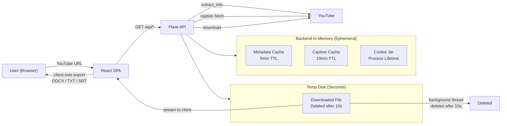
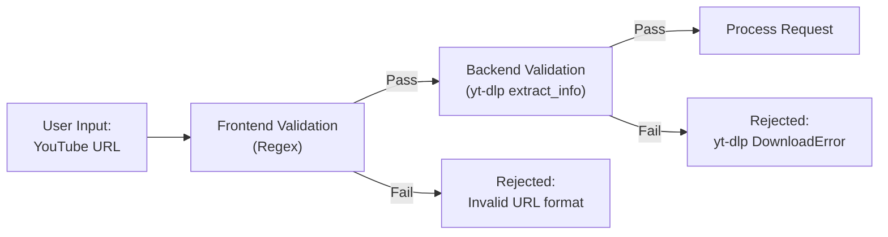
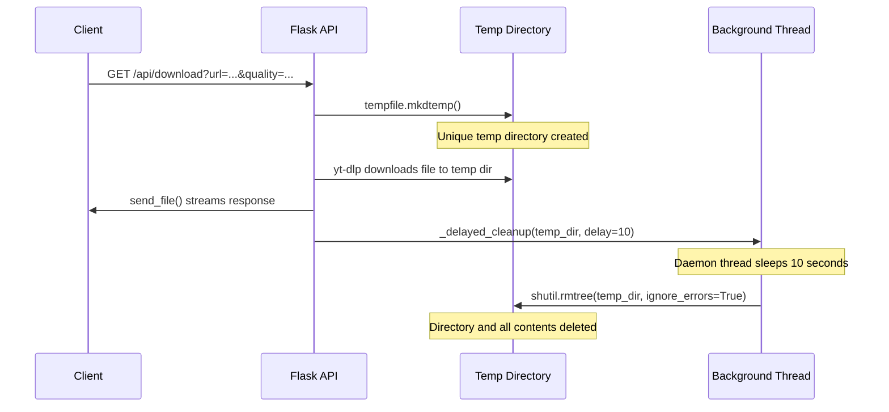

# Security and Privacy

**VoxText AI -- Security, Privacy, and Data Handling Documentation**

> **Purpose:** Define how VoxText AI handles user data, secrets, temporary files, and security concerns. Provide a baseline threat model and actionable recommendations for hardening the application before production deployment.
> **Audience:** Developers, maintainers, security reviewers, and DevOps engineers.
> **Last Updated:** 2026-02-12
> **Version:** 0.1.0

---

## Table of Contents

- [Data Handling Policy](#data-handling-policy)
- [Retention and Storage Policy](#retention-and-storage-policy)
- [Secrets Handling](#secrets-handling)
- [Threat Model](#threat-model)
  - [Abuse Prevention](#abuse-prevention)
  - [Rate Limiting Recommendations](#rate-limiting-recommendations)
  - [Input Validation](#input-validation)
  - [CORS Policy](#cors-policy)
- [File Cleanup Strategy](#file-cleanup-strategy)
- [Safe Logging Practices](#safe-logging-practices)
- [Compliance Notes](#compliance-notes)
- [Production Readiness Recommendations](#production-readiness-recommendations)
- [Related Documents](#related-documents)

---

## Data Handling Policy

VoxText AI is designed with a **privacy-first, zero-persistence architecture**. No database, no user accounts, and no authentication exist in the system.

### What Is Collected (In Memory, During Processing)

| Data | Where | Lifetime | Purpose |
|---|---|---|---|
| YouTube video URL | Backend memory (cache key) | Up to 5 minutes (metadata cache TTL) | Avoid duplicate `yt-dlp` extraction calls |
| Video metadata (title, duration, channel, thumbnail, language) | Backend memory (`_info_cache`) | Up to 5 minutes | Serve `/api/metadata` and `/api/captions` responses |
| Caption segments (text, timestamps) | Backend memory (`_caption_result_cache`) | Up to 10 minutes | Serve `/api/captions` responses without re-fetching |
| YouTube session cookies | Backend memory (`_cookie_jar`, `MozillaCookieJar`) | Process lifetime | Reduce YouTube 429 rate-limit responses |
| Downloaded video/audio files | Temporary directory on disk | Seconds (deleted after response + 10s delay) | Stream file to client, then delete |

### What Is NOT Stored

| Data | Status |
|---|---|
| User identity or personal information | Never collected -- no accounts, no sign-ups, no login |
| IP addresses or browser fingerprints | Not logged or stored by the application (web server/reverse proxy may log separately) |
| Audio or video files beyond temporary processing | Deleted immediately after delivery via background thread |
| Transcripts or exported documents | Generated client-side in the browser; never sent to or stored on the backend |
| Search history or URL history | Not persisted; in-memory cache expires automatically |
| Cookies or tracking pixels | No client-side tracking; no analytics cookies set by the application |

### Data Flow Summary



---

## Retention and Storage Policy

VoxText AI follows a **"not persisted by design"** philosophy. All data is ephemeral.

| Data Type | Storage Location | TTL / Retention | Cleanup Mechanism |
|---|---|---|---|
| Metadata cache (`_info_cache`) | Python dict in process memory | 5 minutes (300 seconds) | Lazy expiration: expired entries removed on next cache access |
| Caption result cache (`_caption_result_cache`) | Python dict in process memory | 10 minutes (600 seconds) | Lazy expiration: expired entries removed on next cache access |
| Shared cookie jar (`_cookie_jar`) | `MozillaCookieJar` in process memory | Process lifetime | Cleared when the server process restarts |
| Temporary download files | `tempfile.mkdtemp()` on disk | Deleted after HTTP response + 10-second delay | Background daemon thread with `shutil.rmtree(ignore_errors=True)` |
| Frontend session state | Browser `sessionStorage` | Current browser tab/session | Cleared when the tab is closed |

**Key points:**

- There is **no database** (SQL, NoSQL, or otherwise).
- There is **no persistent file storage** for user content.
- The server process holds all caches in memory; a restart clears everything.
- Temp directories are created per-request and scoped to a single download operation.

---

## Secrets Handling

### Current Secrets Inventory

| Secret | Location | Required | Exposure Scope |
|---|---|---|---|
| `VITE_YOUTUBE_API_KEY` | Frontend `.env` file | Optional | **Exposed to the browser** (any `VITE_` prefixed variable is bundled into client-side JavaScript by Vite) |

### Important Security Notes

1. **`VITE_` prefix means browser-visible.** Vite embeds all `VITE_`-prefixed environment variables into the client bundle at build time. The `VITE_YOUTUBE_API_KEY` value will be visible in the browser's network requests and JavaScript source. This is by design -- it is used for client-side YouTube Data API calls.

2. **Restrict the API key.** If you use a YouTube Data API key:
   - In the [Google Cloud Console](https://console.cloud.google.com/apis/credentials), restrict the key to:
     - **API restrictions:** YouTube Data API v3 only
     - **Application restrictions:** HTTP referrers, limited to your domain(s) (e.g., `https://voxtext-ai.pages.dev/*`)
   - Set a **daily quota limit** to prevent abuse if the key is exposed.

3. **`.env` is in `.gitignore`.** The root `.gitignore` excludes `.env`, `.env.local`, and `.env.production` files. Only `.env.example` is tracked in version control.

4. **Never commit API keys.** The `.env.example` file contains the variable name with an empty value as a template:
   ```
   VITE_YOUTUBE_API_KEY=
   ```

5. **Backend requires no secrets.** The Flask backend operates with zero environment variables. It requires only `FFmpeg` and `yt-dlp` to be available on the system PATH.

### Recommendations for Secrets Management

- **For production deployments,** use platform-provided secret management (Render environment variables, Cloudflare Workers secrets, etc.) rather than `.env` files on disk.
- **If the API key is compromised,** rotate it immediately in the Google Cloud Console and redeploy the frontend.
- **Audit `.env` files** before any deployment to ensure no unintended secrets are included.

---

## Threat Model

This section provides a basic threat model for the current VoxText AI architecture. It is not exhaustive but covers the most relevant attack surfaces for this type of application.

### Abuse Prevention

**Current state: No rate limiting is implemented.** The backend Flask API has no per-IP throttling, request quotas, or abuse detection. Any client can make unlimited requests to all endpoints.

**Risks of no rate limiting:**

| Risk | Impact | Likelihood |
|---|---|---|
| Resource exhaustion via rapid `/api/download` requests | High -- each download consumes CPU, memory, disk I/O, and bandwidth | Medium |
| YouTube IP ban from excessive `yt-dlp` calls | High -- YouTube rate-limits by source IP; an IP ban affects all users behind that server | Medium |
| Denial of service by flooding `/api/metadata` or `/api/captions` | Medium -- in-memory cache mitigates repeat URLs but not unique URLs | Medium |
| Cost amplification on pay-per-resource hosting (e.g., Render) | Medium -- uncontrolled downloads burn compute credits | Medium |
| Google Translate API abuse via translated caption requests | Low -- fallback only triggers when YouTube returns 429 | Low |

### Rate Limiting Recommendations

Implement rate limiting at **two layers** before production:

**Layer 1: Reverse proxy (nginx or Cloudflare)**

```nginx
# Example nginx rate limiting configuration
http {
    # Define rate limit zones
    limit_req_zone $binary_remote_addr zone=metadata:10m rate=10r/m;
    limit_req_zone $binary_remote_addr zone=download:10m rate=3r/m;
    limit_req_zone $binary_remote_addr zone=general:10m rate=30r/m;

    server {
        # Metadata endpoint: 10 requests per minute per IP
        location /api/metadata {
            limit_req zone=metadata burst=5 nodelay;
            proxy_pass http://127.0.0.1:5000;
        }

        # Download endpoint: 3 requests per minute per IP
        location /api/download {
            limit_req zone=download burst=2 nodelay;
            proxy_pass http://127.0.0.1:5000;
        }

        # All other API endpoints: 30 requests per minute per IP
        location /api/ {
            limit_req zone=general burst=10 nodelay;
            proxy_pass http://127.0.0.1:5000;
        }
    }
}
```

**Layer 2: Application-level middleware (Flask)**

Consider using `flask-limiter` or a custom middleware for finer control:

```python
# Example using flask-limiter (not currently installed)
from flask_limiter import Limiter
from flask_limiter.util import get_remote_address

limiter = Limiter(
    app,
    key_func=get_remote_address,
    default_limits=["30 per minute"]
)

@app.route("/api/download")
@limiter.limit("3 per minute")
def download_video():
    ...
```

**Recommended limits for production:**

| Endpoint | Recommended Limit | Rationale |
|---|---|---|
| `GET /api/metadata` | 10 requests/min/IP | Metadata extraction is CPU-intensive |
| `GET /api/captions` | 10 requests/min/IP | Caption fetching involves external HTTP calls |
| `GET /api/formats` | 10 requests/min/IP | Uses cached data; lighter load |
| `GET /api/download` | 3 requests/min/IP | Downloads are the most resource-heavy operation |

### Input Validation

Input validation is implemented at **two levels**:



**Frontend (client-side regex):**

```
^(https?:\/\/)?(www\.)?(youtube\.com\/watch\?v=|youtube\.com\/shorts\/|youtu\.be\/)[a-zA-Z0-9_-]{11}([?&].*)?$
```

This validates that the input matches expected YouTube URL patterns before any backend call is made. It prevents obviously malformed input from reaching the server.

**Backend (yt-dlp extraction):**

The backend passes the URL directly to `yt_dlp.YoutubeDL.extract_info()`, which performs its own URL validation and extraction. If the URL is invalid, unavailable, private, or deleted, `yt-dlp` raises a `DownloadError` that the backend catches and returns as an appropriate HTTP error response (400, 403, 404).

**Validation gaps to be aware of:**

- The `quality` parameter in `/api/download` is validated against a whitelist (`DURATION_LIMITS` dictionary keys). This is safe.
- The `lang` parameter in `/api/captions` is not explicitly validated but is used only as a dictionary lookup key, so injection is not a practical risk.
- No request body parsing occurs (all endpoints use GET with query parameters), which eliminates most injection vectors.

### CORS Policy

**Current state: Permissive (development mode).**

```python
CORS(app, expose_headers=["Content-Disposition"])
```

This enables CORS for **all origins** with the `Content-Disposition` header exposed. This is appropriate for local development but should be restricted in production.

**Production recommendation:**

```python
CORS(app, origins=["https://voxtext-ai.pages.dev"], expose_headers=["Content-Disposition"])
```

Or, if deploying to a custom domain:

```python
CORS(app, origins=[
    "https://voxtext-ai.pages.dev",
    "https://your-custom-domain.com"
], expose_headers=["Content-Disposition"])
```

**Why this matters:** Without origin restrictions, any website can make API requests to your backend, potentially using your server as a proxy for YouTube downloads. Restricting CORS to known frontend origins prevents unauthorized cross-origin usage.

---

## File Cleanup Strategy

The backend creates temporary files on disk only for the `/api/download` endpoint. The cleanup strategy ensures files do not accumulate.

### Lifecycle of a Download Request



### Implementation Details

| Aspect | Detail |
|---|---|
| **Temp directory creation** | `tempfile.mkdtemp()` -- creates a unique directory in the system's default temp location |
| **File naming** | `%(title)s.%(ext)s` pattern via yt-dlp; output files are MP4 or MP3 |
| **Cleanup trigger** | `_delayed_cleanup(path, delay=10)` called after `send_file()` |
| **Cleanup mechanism** | Background daemon thread (`threading.Thread(daemon=True)`) sleeps for 10 seconds, then calls `shutil.rmtree(path, ignore_errors=True)` |
| **Error handling** | `ignore_errors=True` ensures cleanup does not raise exceptions even if files are locked or already deleted |
| **Failure path cleanup** | If download fails (exception in the `try` block), `shutil.rmtree(temp_dir, ignore_errors=True)` is called immediately in the `except` block |
| **Thread type** | Daemon thread -- automatically terminated when the main process exits (no orphan threads) |

### Edge Cases

- **Server crash during download:** Temp files will remain on disk until the OS cleans them (system temp directory) or manual cleanup.
- **Concurrent downloads:** Each request gets its own `mkdtemp()` directory, so there is no collision between concurrent downloads.
- **Disk space exhaustion:** No built-in disk space monitoring. On constrained environments, consider limiting concurrent downloads or monitoring temp directory usage.

---

## Safe Logging Practices

### Current State

The backend uses `print()` statements for minimal logging:

```python
print(f"[translate] Batch failed ({len(batch)} segments): {e}")
print(f"[captions] Google Translate fallback failed: {e}")
```

### Recommendations

| Practice | Rationale |
|---|---|
| **Do not log full YouTube URLs** | URLs may contain tracking parameters or be linkable to user behavior patterns |
| **Use anonymized video IDs** | Log a truncated or hashed video ID (e.g., `dQw4...`) instead of the full URL |
| **Do not log IP addresses in application code** | Leave IP logging to the reverse proxy or load balancer, where it can be controlled separately |
| **Do not log cookie jar contents** | The shared `MozillaCookieJar` contains YouTube session tokens |
| **Do not log caption text** | Caption content may be copyrighted and is unnecessary for debugging |
| **Use structured logging** | Adopt a JSON-formatted logger (e.g., Python `logging` module with JSON formatter) for machine-parseable logs |
| **Use log levels** | `DEBUG` for cache hits/misses, `INFO` for request lifecycle, `WARN` for rate-limit fallbacks, `ERROR` for failures |
| **Add request IDs** | Generate a unique ID per request for tracing across log entries |

### Example Safe Log Format

```
{"timestamp": "2026-02-12T10:30:00Z", "level": "INFO", "request_id": "a1b2c3", "event": "metadata_extracted", "video_id_prefix": "dQw4", "cache_hit": false, "duration_ms": 1250}
{"timestamp": "2026-02-12T10:30:01Z", "level": "WARN", "request_id": "d4e5f6", "event": "caption_429_fallback", "video_id_prefix": "xYz9", "fallback": "google_translate"}
{"timestamp": "2026-02-12T10:30:05Z", "level": "ERROR", "request_id": "g7h8i9", "event": "download_failed", "video_id_prefix": "aBc1", "error_type": "DownloadError"}
```

---

## Compliance Notes

### YouTube Terms of Service

VoxText AI uses `yt-dlp` to interact with YouTube content. Users must comply with [YouTube's Terms of Service](https://www.youtube.com/t/terms).

- **Personal and educational use:** VoxText AI is designed for personal use, educational purposes, and accessibility (e.g., creating transcripts for hearing-impaired users).
- **Redistribution responsibility:** Users are solely responsible for ensuring they have the right to download or transcribe any content. Do not redistribute copyrighted material without permission from the original creator.
- **Disclaimer:** The application displays a clear user-facing disclaimer about content rights.

### Copyright

- Downloaded videos and transcripts remain the intellectual property of their original creators.
- VoxText AI does not claim ownership of any processed content.
- The application does not circumvent DRM or access controls -- it only processes publicly accessible content and captions that YouTube itself provides.

### GDPR and Privacy Regulations

VoxText AI is **GDPR-friendly by design:**

| GDPR Principle | VoxText AI Compliance |
|---|---|
| **Data minimization** | Only YouTube URLs and metadata are processed; no personal data is collected |
| **Purpose limitation** | Data is used exclusively for the immediate request (transcript generation or download) |
| **Storage limitation** | No persistent storage; all data is ephemeral with defined TTLs |
| **Right to erasure** | Not applicable -- no personal data is stored to erase |
| **Consent** | Not applicable -- no personal data is collected or processed |
| **Data Protection Impact Assessment** | Low risk -- no personal data, no profiling, no automated decision-making |

**Important caveat:** If you deploy VoxText AI behind a reverse proxy or on a hosting platform that logs IP addresses, request URLs, or other metadata, those logs may constitute personal data under GDPR. Configure your infrastructure's logging and retention policies accordingly.

### Google Translate Usage

The backend uses Google Translate's free API (`translate.googleapis.com`) as a fallback for translated captions. This is an unofficial API with no formal terms of service for programmatic use. For production deployments, consider:

- Using the official [Cloud Translation API](https://cloud.google.com/translate) with proper terms
- Implementing your own translation pipeline
- Relying solely on YouTube's built-in translated caption tracks

---

## Production Readiness Recommendations

The following table summarizes actions to take before deploying VoxText AI to production:

| Priority | Area | Recommendation | Current State |
|---|---|---|---|
| **Critical** | Rate Limiting | Add per-IP rate limiting via nginx or `flask-limiter` | Not implemented |
| **Critical** | CORS | Restrict `origins` to your frontend domain(s) | Permissive (all origins) |
| **Critical** | Secrets | Restrict YouTube API key to specific domains and APIs in Google Cloud Console | No restrictions documented |
| **High** | HTTPS | Serve backend over HTTPS (via reverse proxy or platform TLS) | HTTP only in development |
| **High** | Logging | Replace `print()` with structured logging; avoid logging URLs and personal data | Minimal `print()` statements |
| **High** | Process Manager | Use a production WSGI server (Gunicorn, Waitress) instead of Flask dev server | `python server.py` with `debug=True` |
| **High** | Disk Monitoring | Monitor temp directory disk usage; alert on low disk space | No monitoring |
| **Medium** | Download Limits | Add concurrent download limits or a request queue | No concurrency control |
| **Medium** | Request Size | Set maximum request and response timeouts at the reverse proxy level | No explicit timeouts for yt-dlp operations |
| **Medium** | Error Messages | Sanitize error messages to avoid leaking internal details (file paths, stack traces) | Raw exception messages returned in some cases |
| **Medium** | Health Check | Add a `/healthz` endpoint for liveness probes | No health endpoint |
| **Low** | Security Headers | Add `X-Content-Type-Options`, `X-Frame-Options`, `Strict-Transport-Security` headers | No security headers set |
| **Low** | Dependency Scanning | Set up automated dependency vulnerability scanning (e.g., `pip-audit`, `npm audit`) | Not configured |
| **Low** | Cookie Security | Consider encrypting or scoping the shared cookie jar to prevent leakage | Plain `MozillaCookieJar` in memory |

---

## Related Documents

- [README](README.md) -- Project overview and navigation hub
- [Architecture](Architecture.md) -- System architecture, data flow, and deployment modes
- [API](API.md) -- Full API specification with endpoints and error codes
- [Error Handling](Error-Handling.md) -- Error playbook and troubleshooting
- [Setup Guide](Setup-Guide.md) -- Installation, configuration, and deployment
- [CONTRIBUTING](CONTRIBUTING.md) -- Contribution guidelines and security reporting process
