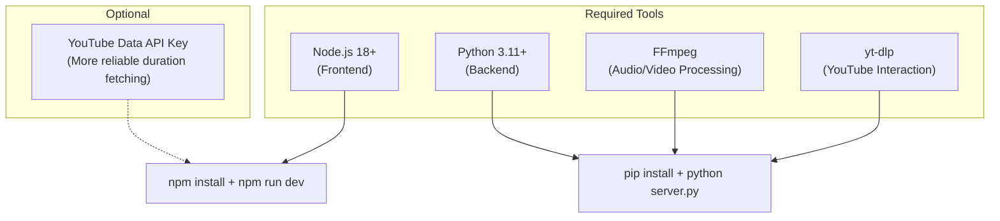
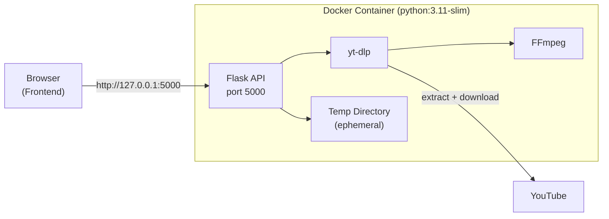
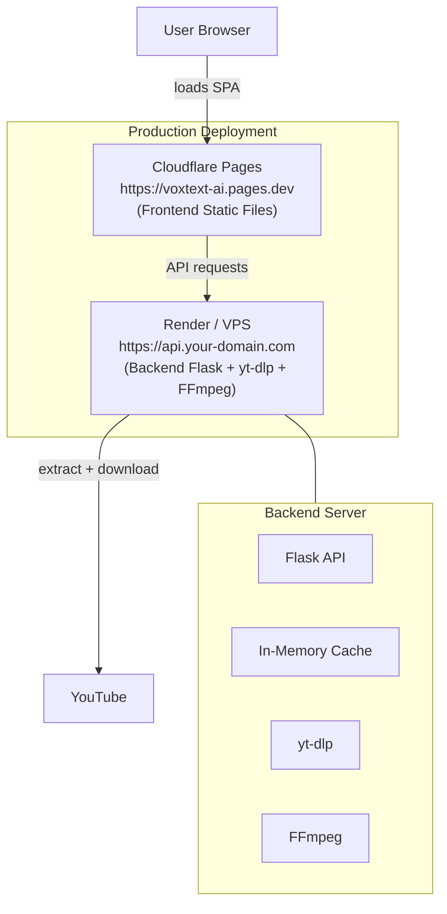

# Setup Guide

**VoxText AI -- Installation, Configuration, and Deployment Guide**

> **Purpose:** Provide step-by-step instructions to set up VoxText AI for local development, configure environment variables, verify the installation, troubleshoot common issues, and deploy to production.
> **Audience:** Developers, operators, and contributors setting up the project for the first time.
> **Last Updated:** 2026-02-12
> **Version:** 0.1.0

---

## Table of Contents

- [Prerequisites](#prerequisites)
  - [Node.js](#nodejs)
  - [Python](#python)
  - [FFmpeg](#ffmpeg)
  - [yt-dlp](#yt-dlp)
- [Clone and Install](#clone-and-install)
- [Backend Setup](#backend-setup)
- [Frontend Setup](#frontend-setup)
- [Environment Configuration](#environment-configuration)
  - [Frontend Environment Variables](#frontend-environment-variables)
  - [How to Get a YouTube Data API Key](#how-to-get-a-youtube-data-api-key)
- [Local Verification Checklist](#local-verification-checklist)
- [Troubleshooting](#troubleshooting)
- [Docker Setup](#docker-setup)
  - [Dockerfile Walkthrough](#dockerfile-walkthrough)
  - [Build and Run](#build-and-run)
- [Deployment Guides](#deployment-guides)
  - [Render (Backend)](#render-backend)
  - [VPS -- Hostinger or Ubuntu](#vps----hostinger-or-ubuntu)
  - [Cloudflare Pages (Frontend)](#cloudflare-pages-frontend)
- [Performance Tips](#performance-tips)
- [Related Documents](#related-documents)

---

## Prerequisites

You need four tools installed before running VoxText AI. Below are installation instructions for each tool on Windows, macOS, and Linux.

### Node.js

**Required version:** 18 or newer (Vite 6 requires Node.js 18+).

| Platform | Installation Method |
|---|---|
| **Windows** | Download the LTS installer from [https://nodejs.org](https://nodejs.org). Run the `.msi` installer and follow the prompts. Ensure "Add to PATH" is checked. |
| **macOS** | Install via Homebrew: `brew install node` or download from [https://nodejs.org](https://nodejs.org). |
| **Linux (Ubuntu/Debian)** | Use NodeSource: `curl -fsSL https://deb.nodesource.com/setup_18.x \| sudo -E bash - && sudo apt-get install -y nodejs` |

Verify installation:

```bash
node --version    # Should print v18.x.x or higher
npm --version     # Should print 9.x.x or higher
```

### Python

**Required version:** 3.11+ recommended, 3.9+ minimum.

| Platform | Installation Method |
|---|---|
| **Windows** | Download from [https://www.python.org/downloads/](https://www.python.org/downloads/). During installation, **check "Add Python to PATH"**. |
| **macOS** | Install via Homebrew: `brew install python@3.11` or download from [python.org](https://www.python.org/downloads/). |
| **Linux (Ubuntu/Debian)** | `sudo apt update && sudo apt install python3.11 python3.11-venv python3-pip` |

Verify installation:

```bash
python --version     # Should print Python 3.11.x or higher
# On some systems, use python3:
python3 --version
```

### FFmpeg

FFmpeg is required by yt-dlp for audio extraction (MP3) and video format merging (MP4). It must be available on your system PATH.

| Platform | Installation Method |
|---|---|
| **Windows** | **Option A (recommended):** Install via winget: `winget install Gyan.FFmpeg`. **Option B:** Install via Chocolatey: `choco install ffmpeg`. **Option C:** Download a build from [https://www.gyan.dev/ffmpeg/builds/](https://www.gyan.dev/ffmpeg/builds/), extract it, and add the `bin` folder to your system PATH. |
| **macOS** | Install via Homebrew: `brew install ffmpeg` |
| **Linux (Ubuntu/Debian)** | `sudo apt update && sudo apt install ffmpeg` |

Verify installation:

```bash
ffmpeg -version    # Should print version info (e.g., ffmpeg version 6.x or 7.x)
```

### yt-dlp

yt-dlp is a Python package that handles all YouTube metadata extraction, caption fetching, and video/audio downloads. It is installed automatically as part of the backend dependencies (`requirements.txt`), but you can also install it system-wide.

```bash
# Installed automatically by pip install -r requirements.txt
# Or install manually:
pip install yt-dlp
```

Verify installation:

```bash
yt-dlp --version    # Should print a date-based version (e.g., 2025.01.15)
```

### Prerequisites Summary



---

## Clone and Install

```bash
# Clone the repository
git clone https://github.com/shasu1pm/VoxText-AI.git
cd VoxText-AI
```

The project structure after cloning:

```
VoxText-AI/
  Backend/
    server.py            # Flask API server
    requirements.txt     # Python dependencies
    Dockerfile           # Docker build file
  Frontend/
    src/                 # React source code
    package.json         # npm dependencies
    vite.config.ts       # Vite configuration
    .env.example         # Environment variable template
  Documentation/         # Project documentation
```

---

## Backend Setup

Open a terminal and run the following commands:

```bash
# Navigate to the backend directory
cd Backend

# Create a Python virtual environment (recommended)
python -m venv .venv

# Activate the virtual environment
# Windows (Command Prompt):
.venv\Scripts\activate
# Windows (PowerShell):
.venv\Scripts\Activate.ps1
# macOS / Linux:
source .venv/bin/activate

# Install Python dependencies from requirements.txt
pip install -r requirements.txt

# Start the Flask development server
python server.py
```

**Expected output:**

```
 * Serving Flask app 'server'
 * Debug mode: on
 * Running on http://127.0.0.1:5000
```

The backend is now running at `http://127.0.0.1:5000`.

**What `requirements.txt` installs:**

| Package | Version Range | Purpose |
|---|---|---|
| `flask` | >=3.1, <4.0 | REST API framework |
| `flask-cors` | >=6.0, <7.0 | Cross-Origin Resource Sharing support |
| `yt-dlp` | >=2025.1, <2027.0 | YouTube metadata, captions, and downloads |

---

## Frontend Setup

Open a **separate terminal** (keep the backend running) and run:

```bash
# Navigate to the frontend directory
cd Frontend

# Install npm dependencies
npm install

# Start the Vite development server
npm run dev
```

**Expected output:**

```
  VITE v6.3.5  ready in 500 ms

  ->  Local:   http://localhost:5173/
  ->  Network: use --host to expose
```

The frontend is now running at `http://localhost:5173`. Open this URL in your browser.

### How the Frontend Connects to the Backend

The backend URL (`http://127.0.0.1:5000`) is hardcoded in the frontend source code. During local development, both services run on `localhost` and communicate directly:

```
Browser (http://localhost:5173)  --->  Flask API (http://127.0.0.1:5000)
```

CORS is enabled on the backend with `Content-Disposition` header exposed, so cross-origin requests from the frontend succeed without issues.

---

## Environment Configuration

### Frontend Environment Variables

The frontend supports one optional environment variable. Create a `.env` file in the `Frontend/` directory based on the provided template:

```bash
# Copy the template
cp Frontend/.env.example Frontend/.env
```

**`.env` file contents:**

```env
# YouTube Data API key (optional but recommended for reliable video duration fetching)
# Get your key at: https://console.cloud.google.com/apis/credentials
# Enable "YouTube Data API v3" in your Google Cloud project
VITE_YOUTUBE_API_KEY=
```

| Variable | Required | Description |
|---|---|---|
| `VITE_YOUTUBE_API_KEY` | No | YouTube Data API v3 key. Enables a more reliable method for fetching video duration. If not set, the app uses alternative fallback methods (Piped API, oEmbed, HTML scraping). |

**Security note:** All `VITE_`-prefixed environment variables are embedded into the client-side JavaScript bundle at build time. The API key will be visible in the browser. See [Security-Privacy.md](Security-Privacy.md) for recommendations on restricting the key.

**Backend environment:** The Flask backend requires **no environment variables**. It only needs `FFmpeg` and `yt-dlp` available on the system PATH.

### How to Get a YouTube Data API Key

Follow these steps to obtain a free YouTube Data API v3 key from Google Cloud Console:

1. Go to [Google Cloud Console](https://console.cloud.google.com/).
2. Create a new project (or select an existing one).
3. Navigate to **APIs & Services** > **Library**.
4. Search for **"YouTube Data API v3"** and click **Enable**.
5. Navigate to **APIs & Services** > **Credentials**.
6. Click **Create Credentials** > **API Key**.
7. Copy the generated API key.
8. **(Recommended)** Click **Restrict Key** and configure:
   - **Application restrictions:** HTTP referrers -- add your domain(s) (e.g., `http://localhost:5173/*` for development).
   - **API restrictions:** Restrict to "YouTube Data API v3" only.
9. Paste the key into your `Frontend/.env` file:
   ```env
   VITE_YOUTUBE_API_KEY=AIzaSy...your-key-here
   ```
10. Restart the Vite dev server (`npm run dev`) to pick up the new variable.

**Free tier quota:** The YouTube Data API v3 provides 10,000 units per day for free. A `videos.list` call (used for duration) costs 1 unit, so this is more than sufficient for development and light production use.

---

## Local Verification Checklist

After starting both the backend and frontend, verify your setup with the following checks:

### 1. Backend Health Check

```bash
curl "http://127.0.0.1:5000/api/metadata?url=https://www.youtube.com/watch?v=dQw4w9WgXcQ"
```

**Expected:** A JSON response with video metadata (title, duration, channel name, thumbnail, language, caption info). If you see a JSON response with `"title": "Rick Astley - Never Gonna Give You Up..."`, the backend is working.

### 2. Test Transcript Flow

1. Open `http://localhost:5173` in your browser.
2. Paste a YouTube URL (e.g., `https://www.youtube.com/watch?v=dQw4w9WgXcQ`).
3. Click **"Read my URL"**.
4. Verify that the video title, thumbnail, duration, and detected language appear.
5. Click **"Get My Transcript"**.
6. Select an output language and click **Generate**.
7. Verify that a transcript appears with timed segments.
8. Download as TXT, SRT, or DOCX and verify the file contents.

### 3. Test Download Flow

1. After loading a video, click **"Download Your Video"**.
2. Verify that available quality options appear with estimated file sizes.
3. Click **Download** on any quality option (use a short video for testing).
4. Verify that the file downloads as an MP4 or MP3.

### Verification Checklist Summary

| Check | Command / Action | Expected Result |
|---|---|---|
| Backend responds | `curl http://127.0.0.1:5000/api/metadata?url=...` | JSON response with video metadata |
| Frontend loads | Open `http://localhost:5173` | React app renders in browser |
| URL validation works | Paste a YouTube URL and click "Read my URL" | Title, thumbnail, duration appear |
| Transcript works | Click "Get My Transcript" and generate | Timed transcript segments appear |
| Export works | Download as TXT/SRT/DOCX | File downloads with correct content |
| Video download works | Click "Download Your Video" and download | MP4/MP3 file downloads |
| FFmpeg available | `ffmpeg -version` | Version info prints |
| yt-dlp available | `yt-dlp --version` | Version date prints |

---

## Troubleshooting

### Port Conflicts (5000 / 5173)

**Symptom:** "Address already in use" or "Port 5000 is in use" error.

**Cause:** Another process is using port 5000 (backend) or 5173 (frontend).

**Solution:**

```bash
# Find what is using port 5000
# Windows:
netstat -ano | findstr :5000
# macOS / Linux:
lsof -i :5000

# Kill the process (replace PID with the actual process ID)
# Windows:
taskkill /PID <PID> /F
# macOS / Linux:
kill -9 <PID>
```

On macOS, AirPlay Receiver uses port 5000 by default. Disable it in **System Settings** > **AirDrop & Handoff** > **AirPlay Receiver**.

### CORS Issues

**Symptom:** Browser console shows `Access-Control-Allow-Origin` errors. API calls from the frontend fail with CORS errors.

**Cause:** The frontend and backend are on incompatible origins, or the backend CORS configuration is not matching.

**Solution:**

- Ensure the backend is running on `http://127.0.0.1:5000` (not `0.0.0.0` or a different port).
- Ensure the frontend is running on `http://localhost:5173`.
- Check that `flask-cors` is installed: `pip list | grep flask-cors`.
- If deploying, update the CORS origins in `server.py` to include your frontend domain.

### yt-dlp Failures

**Symptom:** "DownloadError" or metadata extraction fails. Videos that should work return errors.

**Cause:** Outdated yt-dlp version. YouTube frequently changes its internal APIs, and yt-dlp must be updated regularly to keep up.

**Solution:**

```bash
# Update yt-dlp to the latest version
pip install --upgrade yt-dlp

# Verify the update
yt-dlp --version
```

If you are inside a virtual environment, make sure you activate it first before upgrading.

### FFmpeg Missing

**Symptom:** Audio downloads fail. Video downloads may fail for formats that require merging. Error messages mention FFmpeg.

**Cause:** FFmpeg is not installed or not on the system PATH.

**Solution:**

```bash
# Verify FFmpeg is available
ffmpeg -version

# If not installed, see the Prerequisites section above for your OS.

# Windows - if installed but not on PATH, add it:
# 1. Find your FFmpeg installation (e.g., C:\ffmpeg\bin)
# 2. Add it to your system PATH:
#    Settings > System > About > Advanced system settings > Environment Variables
#    Edit "Path" > Add new entry > paste the bin folder path

# macOS:
brew install ffmpeg

# Linux (Ubuntu/Debian):
sudo apt update && sudo apt install ffmpeg
```

### HTTP 429 (Too Many Requests)

**Symptom:** API calls return 429 errors. YouTube is rate-limiting your server's IP address.

**Cause:** Too many requests to YouTube in a short period, especially for translated caption tracks.

**Solution:**

- Wait 30-60 seconds before retrying.
- The backend's in-memory cache (5-minute TTL for metadata, 10-minute TTL for captions) reduces duplicate requests. Avoid making the same request repeatedly.
- For translated captions, the backend automatically falls back to Google Translate when YouTube returns 429.
- If the issue persists, consider using a different IP or adding delays between requests.

### Backend URL Mismatch

**Symptom:** Frontend loads but API calls fail. The browser console shows failed fetch requests to a different URL than `http://127.0.0.1:5000`.

**Cause:** The backend URL is hardcoded in the frontend source code. If the backend is running on a different host or port, the frontend cannot connect.

**Solution:**

- Ensure the backend is running on the expected address: `http://127.0.0.1:5000`.
- If you need to change the backend URL, find the hardcoded URL in `Frontend/src/app/App.tsx` and update it to match your backend's actual address.
- After changing, restart the Vite dev server.

### Common Error Summary

| Error | Likely Cause | Fix |
|---|---|---|
| `Address already in use` | Port conflict | Kill the conflicting process or change ports |
| `CORS error` in browser console | Origin mismatch | Verify backend is on port 5000, frontend on 5173 |
| `DownloadError` from yt-dlp | Outdated yt-dlp | `pip install --upgrade yt-dlp` |
| FFmpeg-related errors | FFmpeg not installed | Install FFmpeg and add to PATH |
| HTTP 429 | YouTube rate limiting | Wait 30-60 seconds and retry |
| `fetch failed` in browser | Backend not running or URL mismatch | Start backend; check hardcoded URL |
| `ModuleNotFoundError` | Missing Python dependencies | `pip install -r requirements.txt` in venv |
| `npm ERR!` during install | Node.js version too old | Upgrade to Node.js 18+ |

---

## Docker Setup

The project includes a Dockerfile for the **backend only**. The frontend is built as a static site and deployed separately.

### Dockerfile Walkthrough

The Dockerfile is located at `Backend/Dockerfile`:

```dockerfile
FROM python:3.11-slim

# Prevent Python from writing pyc files & enable logs immediately
ENV PYTHONDONTWRITEBYTECODE=1
ENV PYTHONUNBUFFERED=1

# Install system dependencies (ffmpeg required for yt-dlp audio extraction)
RUN apt-get update && apt-get install -y \
    ffmpeg \
    curl \
 && rm -rf /var/lib/apt/lists/*

WORKDIR /app

# Install Python dependencies first (better caching)
COPY requirements.txt .
RUN pip install --no-cache-dir -r requirements.txt

# Copy backend code
COPY server.py .

# Expose Flask port
EXPOSE 5000

# Start Flask server (production: use waitress or gunicorn)
CMD ["python", "server.py"]
```

**Line-by-line explanation:**

| Line | Purpose |
|---|---|
| `FROM python:3.11-slim` | Use the official Python 3.11 slim image (smaller than the full image) |
| `ENV PYTHONDONTWRITEBYTECODE=1` | Prevent `.pyc` files from being written (cleaner container) |
| `ENV PYTHONUNBUFFERED=1` | Ensure print statements and logs appear immediately in `docker logs` |
| `RUN apt-get install -y ffmpeg curl` | Install FFmpeg (required for audio/video processing) and curl (useful for health checks) |
| `COPY requirements.txt .` then `RUN pip install` | Install Python dependencies first for better Docker layer caching |
| `COPY server.py .` | Copy the application code last (changes more frequently) |
| `EXPOSE 5000` | Document that the container listens on port 5000 |
| `CMD ["python", "server.py"]` | Start the Flask server when the container runs |

### Build and Run

```bash
# Navigate to the backend directory
cd Backend

# Build the Docker image
docker build -t voxtext-ai-backend .

# Run the container
docker run -p 5000:5000 voxtext-ai-backend
```

**The backend is now accessible at `http://127.0.0.1:5000`.**

**Useful Docker commands:**

```bash
# Run in detached mode (background)
docker run -d -p 5000:5000 --name voxtext-backend voxtext-ai-backend

# View logs
docker logs voxtext-backend

# Stop the container
docker stop voxtext-backend

# Remove the container
docker rm voxtext-backend

# Rebuild after code changes
docker build -t voxtext-ai-backend . && docker run -p 5000:5000 voxtext-ai-backend
```

### Docker Architecture



---

## Deployment Guides

### Render (Backend)

[Render](https://render.com/) is a cloud platform that supports Docker deployments and Python services.

**Option A: Deploy with Dockerfile**

1. Push your repository to GitHub.
2. In the Render dashboard, create a new **Web Service**.
3. Connect your GitHub repository.
4. Set the following:
   - **Root Directory:** `Backend`
   - **Runtime:** Docker
   - **Instance Type:** Starter or higher
5. Render will detect the `Dockerfile` and build automatically.
6. Set the start command to `python server.py` (or leave it as the Dockerfile's CMD).

**Option B: Deploy as a Python service**

1. Create a new **Web Service** on Render.
2. Set the following:
   - **Root Directory:** `Backend`
   - **Runtime:** Python
   - **Build Command:** `pip install -r requirements.txt`
   - **Start Command:** `python server.py`
3. Add a **pre-deploy command** or use a custom build to install FFmpeg:
   ```bash
   apt-get update && apt-get install -y ffmpeg
   ```

**Environment and RAM tips:**

| Setting | Recommendation |
|---|---|
| **Instance type** | Starter (512 MB RAM) minimum; Standard (1 GB) recommended for concurrent downloads |
| **RAM usage** | Each video download can consume 50-200 MB depending on quality. Use lower qualities for long videos. |
| **Disk** | Render provides ephemeral disk. Temp files are cleaned up by the app. |
| **Health check path** | Set to `/api/metadata?url=https://www.youtube.com/watch?v=dQw4w9WgXcQ` (or add a `/healthz` endpoint) |
| **CORS** | Update `server.py` to restrict CORS origins to your Cloudflare Pages domain |

### VPS -- Hostinger or Ubuntu

For a self-managed VPS (e.g., Hostinger VPS, DigitalOcean Droplet, or any Ubuntu server):

**Step 1: Install system dependencies**

```bash
sudo apt update && sudo apt upgrade -y
sudo apt install python3.11 python3.11-venv python3-pip ffmpeg nginx -y
```

**Step 2: Clone and set up the backend**

```bash
cd /opt
sudo git clone https://github.com/shasu1pm/VoxText-AI.git
cd VoxText-AI/Backend

# Create virtual environment
python3.11 -m venv .venv
source .venv/bin/activate

# Install dependencies
pip install -r requirements.txt
```

**Step 3: Create a systemd service**

Create the file `/etc/systemd/system/voxtext-backend.service`:

```ini
[Unit]
Description=VoxText AI Backend (Flask)
After=network.target

[Service]
Type=simple
User=www-data
WorkingDirectory=/opt/VoxText-AI/Backend
ExecStart=/opt/VoxText-AI/Backend/.venv/bin/python server.py
Restart=always
RestartSec=5
Environment=PYTHONUNBUFFERED=1

[Install]
WantedBy=multi-user.target
```

Enable and start the service:

```bash
sudo systemctl daemon-reload
sudo systemctl enable voxtext-backend
sudo systemctl start voxtext-backend

# Check status
sudo systemctl status voxtext-backend
```

**Step 4: Configure nginx as a reverse proxy**

Create the file `/etc/nginx/sites-available/voxtext-api`:

```nginx
server {
    listen 80;
    server_name api.your-domain.com;

    # Rate limiting zones
    limit_req_zone $binary_remote_addr zone=api_general:10m rate=30r/m;
    limit_req_zone $binary_remote_addr zone=api_download:10m rate=3r/m;

    location /api/download {
        limit_req zone=api_download burst=2 nodelay;

        proxy_pass http://127.0.0.1:5000;
        proxy_set_header Host $host;
        proxy_set_header X-Real-IP $remote_addr;
        proxy_set_header X-Forwarded-For $proxy_add_x_forwarded_for;
        proxy_set_header X-Forwarded-Proto $scheme;

        # Longer timeout for downloads
        proxy_read_timeout 600s;
        proxy_send_timeout 600s;
    }

    location /api/ {
        limit_req zone=api_general burst=10 nodelay;

        proxy_pass http://127.0.0.1:5000;
        proxy_set_header Host $host;
        proxy_set_header X-Real-IP $remote_addr;
        proxy_set_header X-Forwarded-For $proxy_add_x_forwarded_for;
        proxy_set_header X-Forwarded-Proto $scheme;
    }
}
```

Enable the site and reload nginx:

```bash
sudo ln -s /etc/nginx/sites-available/voxtext-api /etc/nginx/sites-enabled/
sudo nginx -t                # Test configuration
sudo systemctl reload nginx
```

**Step 5: Set up HTTPS with Certbot (recommended)**

```bash
sudo apt install certbot python3-certbot-nginx -y
sudo certbot --nginx -d api.your-domain.com
```

### Cloudflare Pages (Frontend)

[Cloudflare Pages](https://pages.cloudflare.com/) is a free platform for deploying static sites. The live VoxText AI frontend is already deployed at `https://voxtext-ai.pages.dev/`.

**Step 1: Build the frontend**

```bash
cd Frontend
npm run build
```

This creates a `dist/` directory with the production build.

**Step 2: Deploy to Cloudflare Pages**

**Option A: Git integration (recommended)**

1. Push your repository to GitHub.
2. In the Cloudflare dashboard, go to **Workers & Pages** > **Create** > **Pages**.
3. Connect your GitHub repository.
4. Configure the build:
   - **Build command:** `npm run build`
   - **Build output directory:** `Frontend/dist`
   - **Root directory:** `Frontend`
5. Cloudflare builds and deploys automatically on every push.

**Option B: Direct upload**

1. Run `npm run build` locally.
2. In the Cloudflare dashboard, create a new Pages project.
3. Upload the contents of `Frontend/dist/`.

**Step 3: Update the backend URL**

The backend URL is hardcoded in `Frontend/src/app/App.tsx`. Before deploying to production:

1. Find all references to `http://127.0.0.1:5000` in the frontend source.
2. Replace with your production backend URL (e.g., `https://api.your-domain.com`).
3. Rebuild and redeploy.

**Step 4: Set environment variables (optional)**

In the Cloudflare Pages project settings, you can set environment variables:

- **Variable name:** `VITE_YOUTUBE_API_KEY`
- **Value:** Your YouTube Data API key

Cloudflare injects these at build time.

### Deployment Architecture Overview



---

## Performance Tips

### Caching Benefits

The backend's in-memory caching significantly reduces load and response times:

| Cache | TTL | Benefit |
|---|---|---|
| Metadata cache (`_info_cache`) | 5 minutes | Avoids redundant `yt-dlp` `extract_info()` calls. If a user requests metadata, captions, formats, and download for the same video, `extract_info` runs only once. |
| Caption result cache (`_caption_result_cache`) | 10 minutes | Avoids re-fetching and re-parsing captions for the same video and language combination. |
| Shared cookie jar (`_cookie_jar`) | Process lifetime | Maintains YouTube session cookies to reduce 429 rate-limit responses. |

### Limiting High-Quality Downloads

Higher quality downloads consume more resources:

| Quality | Typical File Size (10-min video) | Processing Load |
|---|---|---|
| 720p HD | 100-200 MB | High (video + audio merge via FFmpeg) |
| 480p | 50-100 MB | Medium |
| 360p | 25-50 MB | Low-Medium |
| 240p | 10-25 MB | Low |
| Audio Only | 5-15 MB | Low (audio extraction via FFmpeg) |

**Recommendations for constrained environments:**

- On servers with 512 MB RAM, limit downloads to 480p or lower.
- For long videos (over 30 minutes), prefer 360p or 240p to reduce download time and disk usage.
- The backend enforces duration limits per quality tier (e.g., 720p limited to 45 minutes) to prevent excessive resource usage.

### Using Lower Resolutions for Long Videos

The backend's duration limits are designed to balance quality with resource usage:

| Quality | Max Duration | Rationale |
|---|---|---|
| 720p HD | 45 minutes | HD files are large; limits disk and bandwidth usage |
| 480p | 60 minutes | Moderate quality with reasonable file sizes |
| 360p | 120 minutes | Good for lectures and long-form content |
| 240p | 120 minutes | Maximum duration at lowest quality |
| Audio Only | 60 minutes | Small files but still limits very long content |

### General Tips

- **Keep yt-dlp updated.** Run `pip install --upgrade yt-dlp` regularly. YouTube changes its APIs frequently, and outdated versions may fail.
- **Monitor temp disk usage.** On servers with limited disk space, monitor the system temp directory. While the backend cleans up after each request, concurrent downloads can temporarily consume significant disk space.
- **Use a production WSGI server.** For production, replace `python server.py` (Flask development server) with Gunicorn or Waitress for better concurrency and stability:
  ```bash
  # Install gunicorn
  pip install gunicorn

  # Run with gunicorn (4 workers)
  gunicorn -w 4 -b 0.0.0.0:5000 server:app
  ```
- **Consider a CDN for the frontend.** Cloudflare Pages already serves as a CDN. If self-hosting the frontend, consider placing it behind Cloudflare or another CDN for faster global delivery.

---

## Related Documents

- [README](README.md) -- Project overview and navigation hub
- [Architecture](Architecture.md) -- System architecture, data flow, and deployment modes
- [API](API.md) -- Full API specification with endpoints and error codes
- [Security and Privacy](Security-Privacy.md) -- Security practices, threat model, and data handling
- [Error Handling](Error-Handling.md) -- Error playbook and troubleshooting
- [CONTRIBUTING](CONTRIBUTING.md) -- Contribution guidelines
