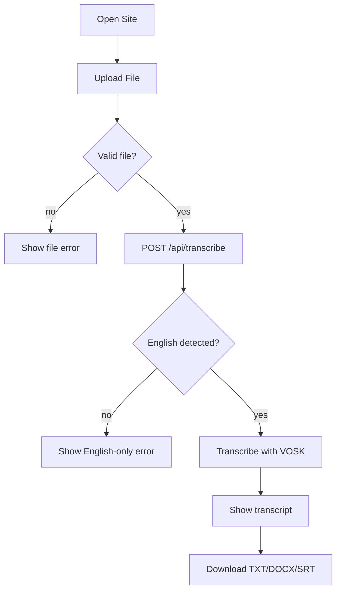
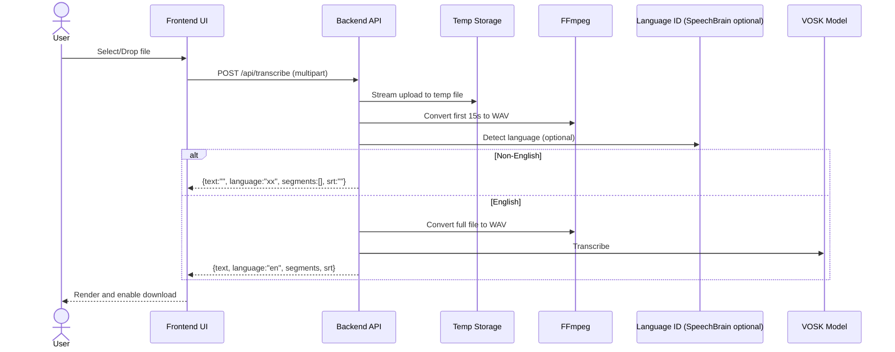

# Workflow

This document describes how VoxText works today based on the current repository.

## Product Summary (Current)

- **Current engine:** VOSK (offline, English-only)
- **Frontend:** React + Vite (static site)
- **Backend:** FastAPI + FFmpeg
- **Worker/Queue:** None (processing happens inside the API request)
- **YouTube links:** Not implemented in this repo (UI text mentions it, but there is no URL input or processing code)

## User Journey (Product View)

1. **Upload** an audio/video file.
2. **Processing** begins immediately.
3. **Transcript** returns for English files.
4. **Download** TXT, DOCX, or SRT.

## System Workflow (Engineering View)

1. UI validates file type and size.
2. UI POSTs multipart form data to `/api/transcribe` (fallback `/transcribe`).
3. Backend streams the file to a temp location (no full file in RAM).
4. Backend converts the first 15 seconds to WAV for language detection.
5. If **non-English**, the backend returns early with an empty transcript.
6. If **English**, backend converts full file and transcribes with VOSK.
7. Backend returns `text`, `language`, `segments`, and `srt`.
8. UI renders transcript and enables downloads.

## English-Only Gating (Current Behavior)

If non-English is detected, the UI shows the exact message:

> "Sorry: We currently support transcription in English only. We're actively working with the community to add 98+ other languages. Please click \"Reset\" and try again with an English recording."

The API response in this case includes empty text and segments, plus the detected language code.

## User Flow Diagram



## System Sequence Diagram



## Localhost Workflow

Backend (Windows):
```cmd
cd Backend
start_server.bat
```

Backend (macOS/Linux):
```bash
cd Backend
chmod +x start_server.sh
./start_server.sh
```

Frontend:
```bash
cd Frontend
npm install
npm run dev
```

Open:
- Frontend: `http://localhost:5173`
- Backend: `http://localhost:8000`